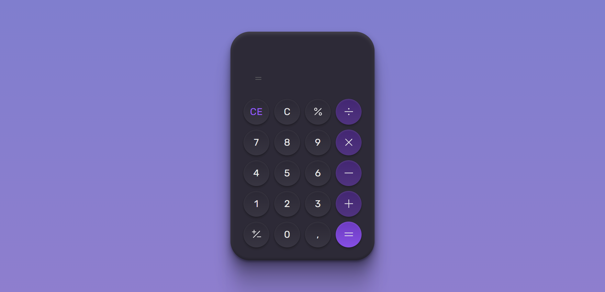

<h1 align="center"> Desafio 05 #BoraCodar </h1>

  <a href="#-tecnologias">Tecnologias</a>&nbsp;&nbsp;&nbsp;|&nbsp;&nbsp;&nbsp;
  <a href="#-sobre">Sobre</a>&nbsp;&nbsp;&nbsp;|&nbsp;&nbsp;&nbsp;
  <a href="#-preview">Preview</a>&nbsp;&nbsp;&nbsp;|&nbsp;&nbsp;&nbsp;
  <a href="#-liks">Links</a>

 

## 🧾Sobre
Desafio proposto pala rocketseat para testarmos nossas habilidades. Desafio número 05, codar uma calculadora. #BoraCodar .

## 🔎 Preview

  

## 🚀 Tecnologias

Esse projeto foi desenvolvido com as seguintes tecnologias:

- HTML
- CSS
- JavaScript

## ✍️ Links

Link para acessar o site: https://sammyferreira1.github.io/BoraCodar05-Rocketseat/

---
